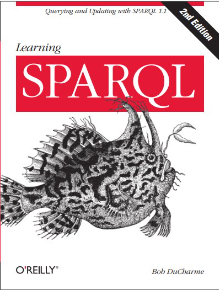
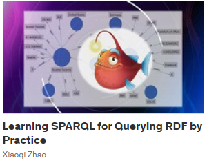
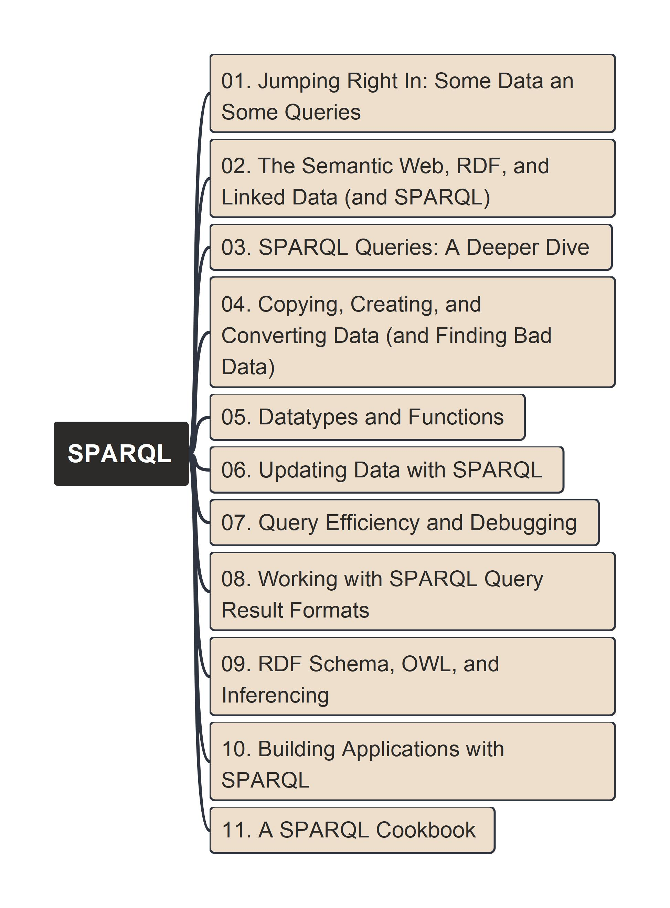

# Learn SPARQL

| Book | Course |
| --- | --- |
| Learn by practicing on book "Learning SPARQL", which is authored by [Bob DuCharme](https://www.linkedin.com/in/bobdc/) | Welcome to enroll the demo course packaging in Udemy now: |
|  |  |

<!-- Learn by practicing on book "Learning SPARQL", which is authored by [Bob DuCharme](https://www.linkedin.com/in/bobdc/)

Welcome to enroll the demo course packaging in Udemy now:

 -->

---

## Contents per Chaperts

- [Ch00 - Preface](./ch00/)
- [Ch01 - Jumping Right In: Some Data and Some Queries](./ch01/)
- [Ch02 - The Semantic Web, RDF, and Linked Data (and SPARQL)](./ch02/)
- [Ch03 - SPARQL Queries: A Deeper Dive](./ch03/)
- [Ch04 - Copying, Creating and Converting Data](./ch04/)
- [Ch05 - Datatypes and Functions](./ch05/)
- [Ch06 - Updating Data with SPARQL](./ch06/)

---

## Mindmap of the Book

---

## Use "RDF Grapher" to Visualize RDF Data

Here [RDF Grapher](https://www.ldf.fi/service/rdf-grapher) is one nice online tool that can parse RDF data and visualize it as a graph, I'm using this to generate visualized diagram for the data file in the course, and store the exported image in the same data file folder respectively.

---

Feel free to raise your comments or questions to me via [Email](mailto:xiaoqizhao@outlook.com), good luck!