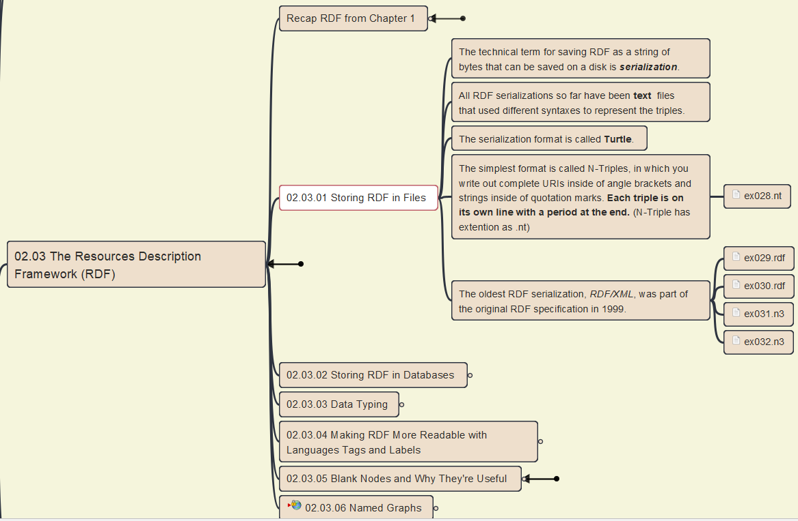
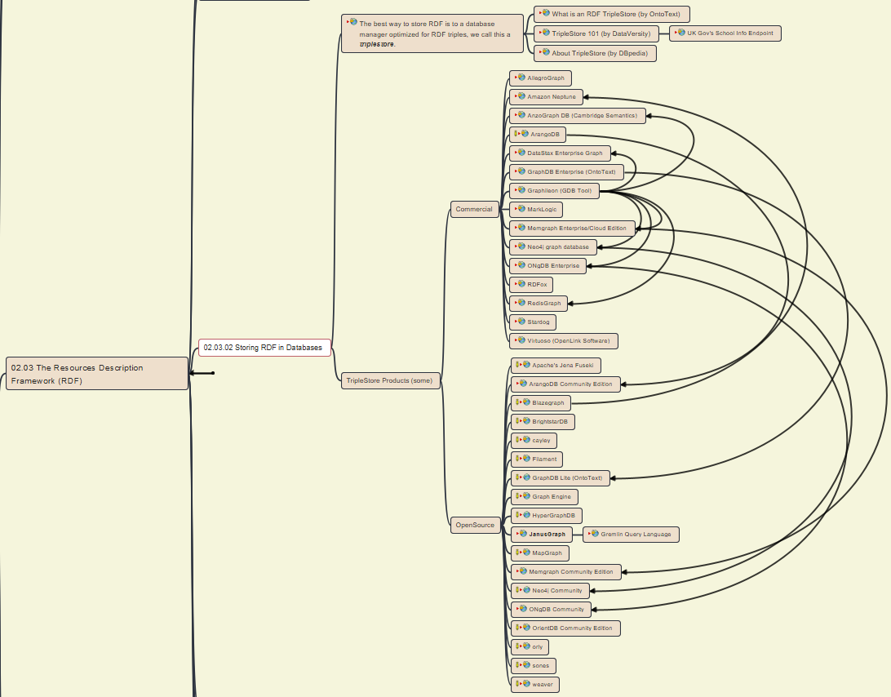
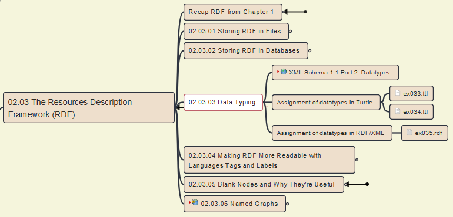
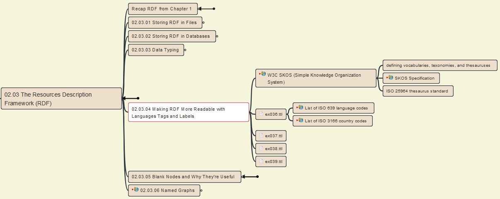
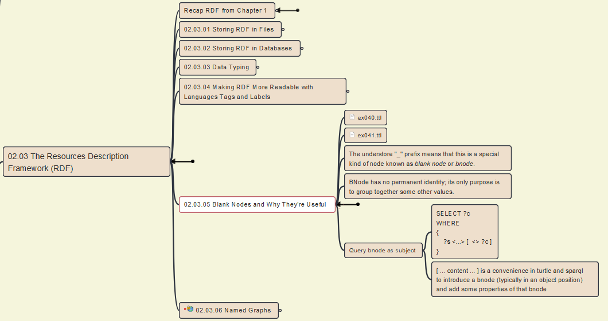

# 02.03 The Resource Description Framework (RDF)

## 02.03.00 Recap RDF from Chapter 1

## 02.03.01 Storing RDF in Files

## 02.03.02 Storing RDF in Databases

## 02.03.03 Data Typing

## 02.03.04 Making RDF More Readable with Languages Tags and Labels

## 02.03.05 Blank Nodes and Whey They're Useful

## 02.03.06 Named Graphs