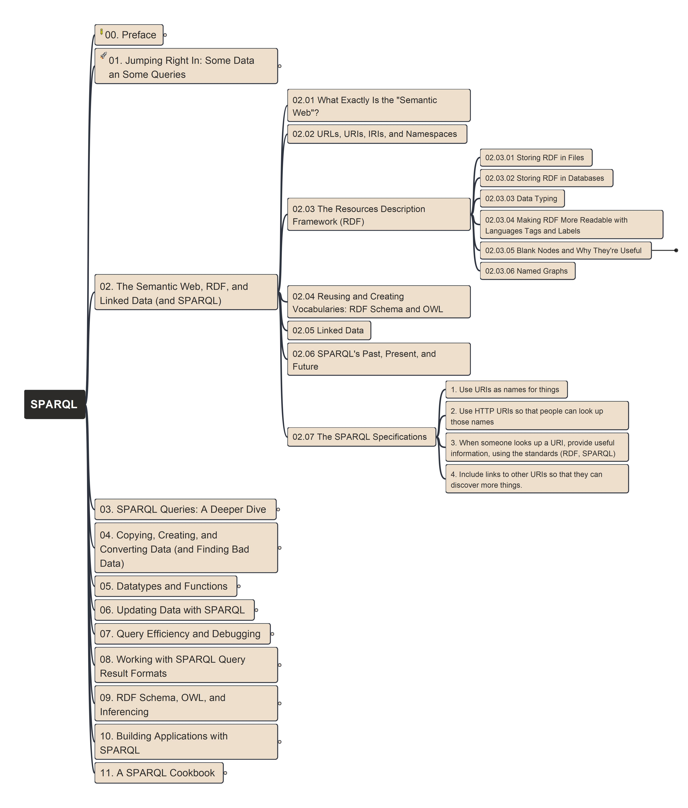
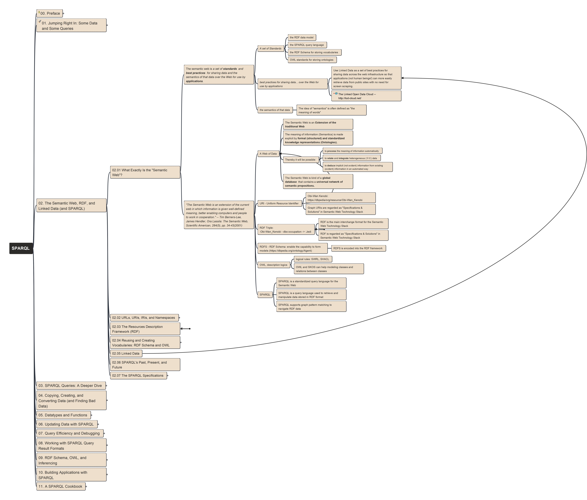
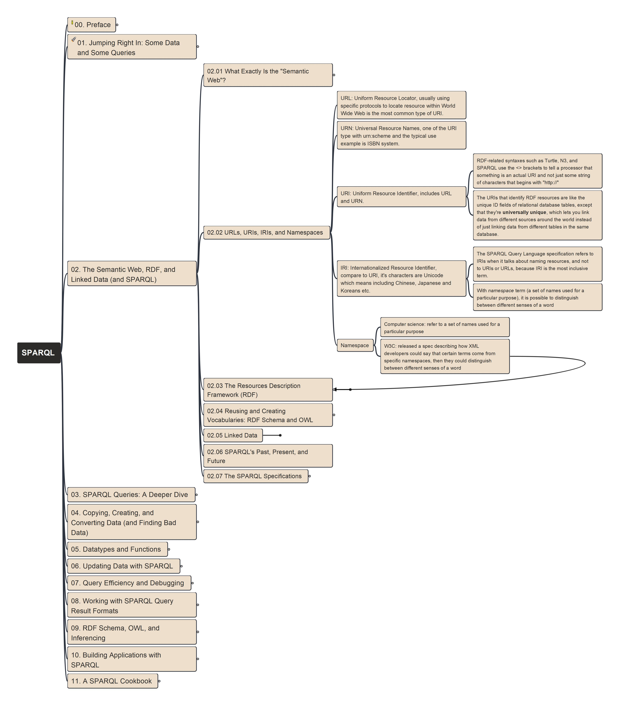
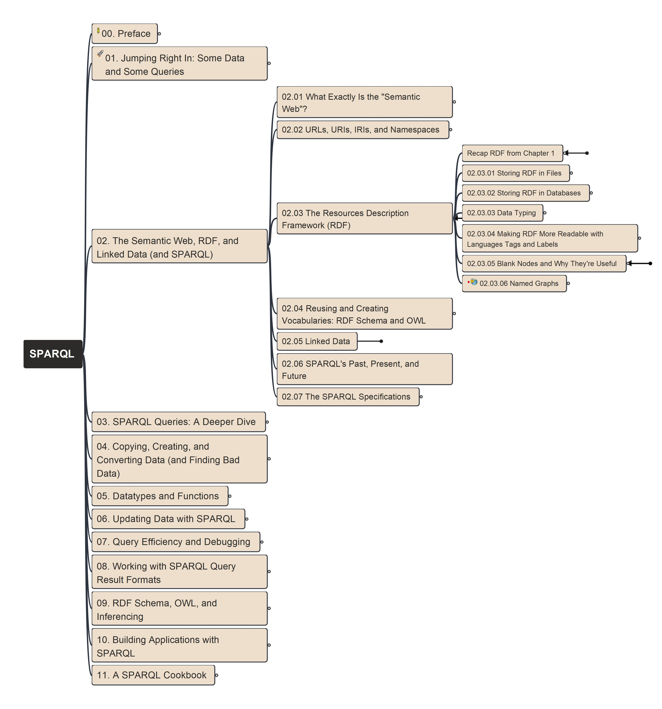

# Chapter 2: The Semantic Web, RDF and Linked Data (& SPARQL)

---

## 02.01 What Exactly is the "Semantic Web"?

## 02.02 URL, URNs, URIs, IRIs, and Namespaces

## 02.03 The Resource Description Framework (RDF)

## 02.04 Reusing and Creating Vocabularies: RDF Schema and OWL

## 02.05 Linked Data

## 02.06 SPARQL's Past, Present, and Future

## 02.07 The SPARQL Specifications